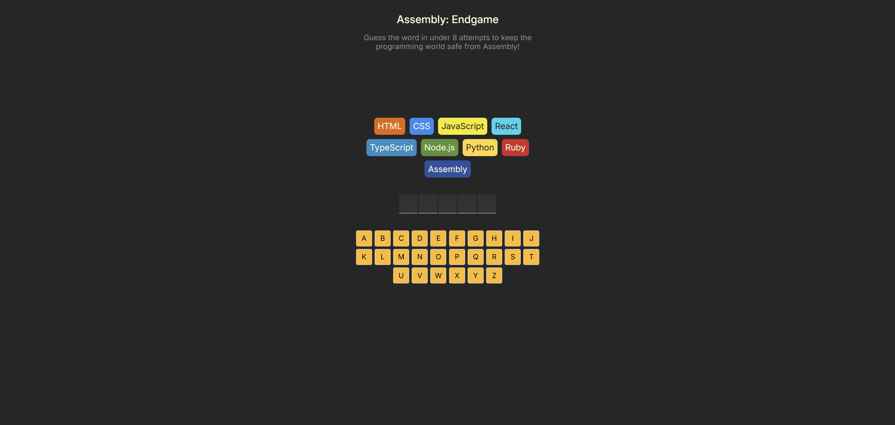

# Assembly: Endgame

Assembly: Endgame is a word-guessing game where every wrong guess erases a programming language. Your mission? Save the languages before Assembly takes over! If you lose, all languages except Assembly will vanish and you’ll have no choice but to learn Assembly. 😜

How to play:
"Guess the word in 8 attempts or lose all languages except Assembly!"

## Project Installation

Like all **_React + Vite_** projects, follow these steps

-   Ensure Node.js is installed (latest stable version)
-   Download the project.
-   Open a terminal (either VS Code Terminal or Command Prompt) in the project's root folder.
-   Run **npm i** to install dependencies.
-   Run **npm run dev** to start the project.
-   Open your browser and visit http://localhost:5173/

## Home Page

Game's preview

### Why Vite?

Vite is a modern front-end build tool that provides fast development and efficient bundling. [**Learn More here**](https://vite.dev/).
